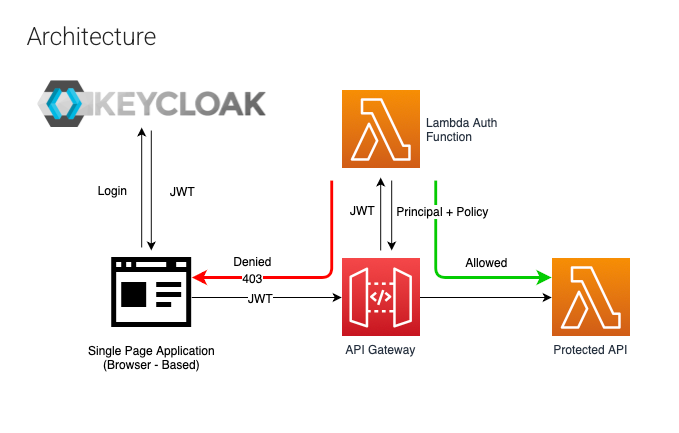

# AWS Monitoring and Management APIs


This repository provides APIs for managing and monitoring AWS resources such as EC2, RDS, S3, and ECS. Each API is organized in its own folder with necessary configurations, functions, and deployment files.

## API Folders Overview

### 1. **ec2-api**
- **Description**:
  APIs for managing and monitoring EC2 instances. These APIs automate the setup of monitoring, fetching instance metrics, and creating alarms.
- **Key Features**:
    - Monitor CPU, memory, disk usage, and set thresholds.
    - Fetch real-time EC2 instance performance metrics.
---

### 2. **rds-api**
- **Description**:
  APIs to manage and monitor RDS instances. Includes functionality for fetching cluster and standalone RDS details with filtering and pagination.
- **Key Features**:
    - Retrieve details of RDS clusters

---

### 3. **s3-api**
- **Description**:
  APIs for managing and monitoring Amazon S3 buckets, including bucket operations and object-level management.
- **Key Features**:
    - Monitor S3 bucket storage and traffic access logs.

---

### 4. **ecs-api**
- **Description**:
  APIs for managing and monitoring Amazon ECS services and clusters, ensuring container-based workloads are optimized and monitored effectively.
- **Key Features**:
    - Create monitoring setups for ECS services.
    - Fetch ECS cluster and service statistics.

---

## Deployment Instructions

To deploy any of the APIs, follow these steps:

1. **Ensure Pre-requisites**:
    - Python 3.10 installed.
    - AWS CLI configured with valid credentials.
    - AWS SAM CLI installed for deploying the serverless applications.

2. **Deployment**:
    - Navigate to the required API folder (e.g., `ec2-api`, `rds-api`).
    - Build and deploy using AWS SAM CLI:
      ```bash
      sam build
      sam deploy
      ```

---

## Project Auth
