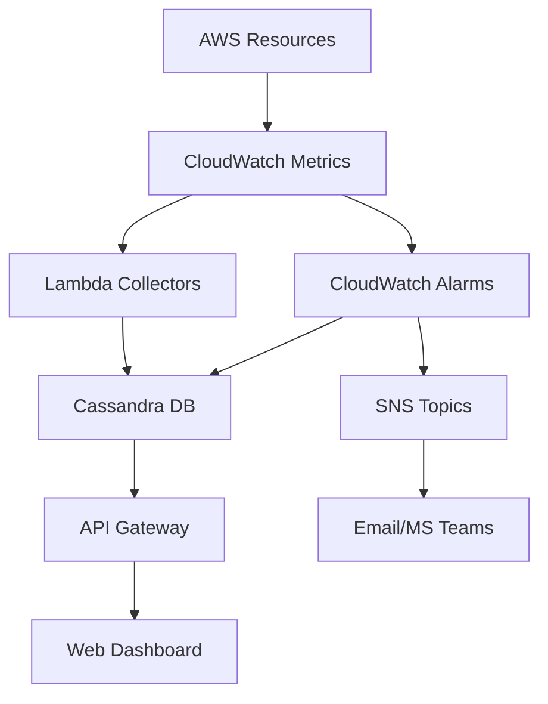

# AWS Resource Monitoring System - High Level Plan

## 1. System Architecture

### Core Components
- AWS Lambda Functions
- API Gateway
- CloudWatch
- Cassandra Time Series DB
- SNS Topics
- IAM Roles & Policies

## 2. Data Flow Architecture



## 3. Implementation Phases

### Phase 1: Infrastructure Setup
- [ ] Set up AWS resources
  - Lambda functions
  - API Gateway
  - SNS topics
  - IAM roles
- [ ] Configure Cassandra cluster
- [ ] Set up monitoring dashboard

### Phase 2: Core Monitoring Implementation

#### EC2 Monitoring
- [ ] Automated instance discovery
- [ ] Metric collection setup
  - CPU Utilization
  - Memory Utilization
  - Disk Usage
  - Status Check
  - Load Average
- [ ] Alarm configuration
  - Default thresholds
  - Custom thresholds
  - Notification setup

#### RDS Monitoring
- [ ] Database instance discovery
- [ ] Metric collection
  - CPU Utilization
  - Freeable Memory
  - DB Connections
  - Other specified metrics
- [ ] Alarm setup

### Phase 3: Data Storage & Retrieval

#### Cassandra Schema
```sql
-- Metrics Table
CREATE TABLE metrics (
    service_type text,
    resource_id text,
    metric_name text,
    timestamp timestamp,
    value double,
    PRIMARY KEY ((service_type, resource_id), metric_name, timestamp)
);

-- Alarms Table
CREATE TABLE alarms (
    alarm_id text,
    service_type text,
    resource_id text,
    metric_name text,
    threshold double,
    status text,
    last_updated timestamp,
    notification_targets list<text>,
    PRIMARY KEY (alarm_id)
);
```

### Phase 4: Real-time Updates

#### WebSocket Implementation
- [ ] API Gateway WebSocket setup
- [ ] Connection management
- [ ] Real-time data streaming
- [ ] Client subscription handling

## 4. Automated Operations

### Instance Monitoring Setup
```python
# Pseudo-code for automated monitoring setup
def setup_instance_monitoring(instance_id):
    # Create CloudWatch alarms
    create_cpu_alarm(instance_id)
    create_memory_alarm(instance_id)
    create_disk_alarm(instance_id)
    
    # Store alarm configurations
    store_alarm_config(instance_id, alarms)
    
    # Set up metric collection
    setup_metric_collection(instance_id)
```

### Alarm Management
```python
# Pseudo-code for alarm management
def manage_alarms(instance_id):
    # Create alarms
    alarms = create_cloudwatch_alarms(instance_id)
    
    # Store in Cassandra
    store_alarms_in_cassandra(alarms)
    
    # Set up notifications
    configure_notifications(alarms)
```

## 5. API Endpoints

### REST API
```
GET    /api/v1/metrics
GET    /api/v1/alarms
POST   /api/v1/monitoring/enable
POST   /api/v1/monitoring/disable
GET    /api/v1/instances
```

### WebSocket API
```
ws://api/monitoring/stream
```

## 6. Security Implementation

### IAM Policies
```json
{
    "Version": "2012-10-17",
    "Statement": [
        {
            "Effect": "Allow",
            "Action": [
                "cloudwatch:PutMetricAlarm",
                "cloudwatch:DeleteAlarms",
                "cloudwatch:DescribeAlarms"
            ],
            "Resource": "*"
        }
    ]
}
```

## 7. Monitoring Dashboard Features

### Real-time Metrics
- [ ] Live metric graphs
- [ ] Alarm status
- [ ] Resource health
- [ ] Notification history

### Configuration
- [ ] Threshold adjustment
- [ ] Notification preferences
- [ ] Resource selection

## 8. Testing Strategy

### Unit Tests
- [ ] Lambda functions
- [ ] Data processing
- [ ] Alarm creation

### Integration Tests
- [ ] API endpoints
- [ ] Database operations
- [ ] Real-time updates

### Load Tests
- [ ] Metric collection
- [ ] Real-time updates
- [ ] Database performance

## 9. Deployment Strategy

### Infrastructure as Code
```yaml
# SAM template structure
AWSTemplateFormatVersion: '2010-09-09'
Transform: AWS::Serverless-2016-10-31
Resources:
  MonitoringFunction:
    Type: AWS::Serverless::Function
    Properties:
      Handler: index.handler
      Runtime: python3.9
      Events:
        ApiEvent:
          Type: Api
          Properties:
            Path: /monitoring
            Method: post
```

## 10. Maintenance & Operations

### Monitoring
- [ ] System health checks
- [ ] Performance metrics
- [ ] Error tracking

### Backup & Recovery
- [ ] Database backups
- [ ] Configuration backups
- [ ] Recovery procedures 